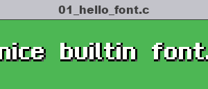
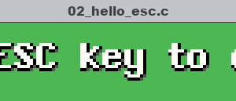
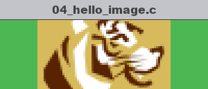
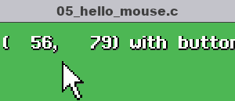
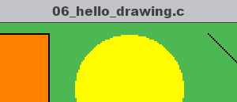
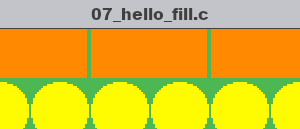

# Fun with TIGR 
A bunch of small programs to demonstrate what you can do with
[TIGR, the TIny GRaphics library](https://github.com/erkkah/tigr).
Each program is designed to be minimal to get you going
very quicky.  There are lots of comments the first time something new shows
up, but we dont' repeat those comments in later programs.

Writing programs that use graphics are fun.  Have fun!

## No comment

Each fun program is in its own single `.c` file and is heavily
commented for sections introducing new things.  If the comments are
in your way, try the equivalent `.c` file whose name begins `no_comment_`.
Only the comment describing the programs were kept.

## Fun programs
| | |
| :---: | :---: |
| [](00_hello_window.c) | [](01_hello_font.c) |
| [](02_hello_esc.c) | [](03_hello_characters.c) |
| [](04_hello_image.c) | [](05_hello_mouse.c) |
| [](06_hello_drawing.c) | [](07_hello_fill.c) |
| [](99_meatballs.c) | |

## Building these fun programs

### Building with GNU Make

For simplicity, you can use GNU Make to build all the fun programs at once.
It's written to assume you have `gcc`, but you can change it if needed.
To build everything, run the command...

```make```

To delete ("clean") all the built fun program executables and TIGR
object file, run the command...

```make clean```

### Building fun programs yourself

TIGR is cross platform, but you will need to link the correct libraries
based on your host operating system.  For the sake of these examples, I'm
using GCC/G++, although the same options worked with Clang/Clang++ at the
time this was written.

Since each fun TIGR program is written in only one source file, these can be
compiled with tigr.c very easily.  Keep in mind that linking flags differ
by host operating system.

| **Host Operating System** | **Link with...** |
| :---: | :--- |
| Windows | `-lopengl32 -lgdi32` |
| macOS | `-framework OpenGL -framework Cocoa` |
| Linux<sup>*</sup> | `-lGLU -lGL -lX11` |

<sup>*</sup> For Linux/Ubuntu users, you'll need to install the X11 and
MESA-based utility library files... `sudo apt install libx11-dev
libglu1-mesa-dev`

### An example build

As an example, if I were building the simplest fun TIGR program,
00_hello_window.c, using GCC on my Ubuntu Linux system...

```gcc -o 00_hello_window 00_hello_window.c tigr.c -lGLU -lGL -lX11```

## License
This source code is licensed under the MIT license found in the
[LICENSE](LICENSE) file in the root directory of this source tree.
